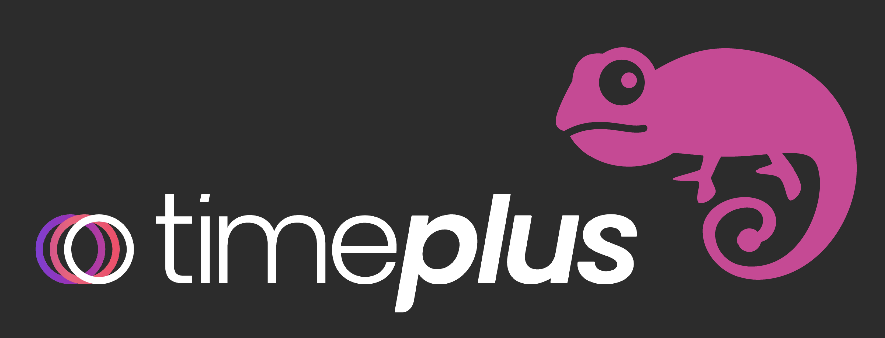
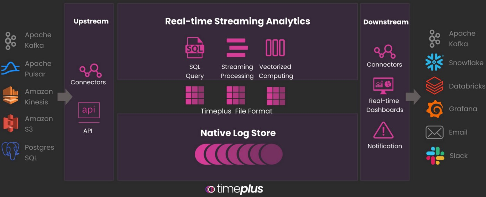

# Timeplus Chameleon

Make stream data test easy and efficient!

## What is Timeplus

Timeplus is a purpose-built streaming analytics platform that solves enterprises’ need for easy-to-implement real-time analytics. Timeplus adapts a streaming-first architecture to redesign real-time analytics from ingestion to action, helping enterprises analyze massive sets of streaming data faster. We provide a dynamic schema for real-time analytics, bringing unprecedented flexibility to data querying and processing. This empowers enterprises to extract substantial value from data before it goes obsolete. Timeplus is unique in its features and functionality, enabling users to make real-time analytics:

- **Fast**: Users can run lightning-fast analytics with ultra-low latency, while ensuring extremely high EPS (events-per-second), both with ingestion and query simultaneously. Our testing demonstrates highly compelling results: Timeplus can achieve 4 millisecond end-to-end latency, and 10 million + EPS benchmark even in a single commodity machine.

- **Powerful**: Users can quickly analyze real-time streaming data, while simultaneously connecting to historical data assets. We use a converged multi-tier computation engine, which reduces data redundancy while substantially lowering costs. We’ve developed powerful real-time streaming analytics that enable functionality such as windowing/non-windowing, late event, downsampling and streaming predictive analytics. All from one SQL query.

- **Intuitive**: Users get speed, ease-of-use, and advanced analytics functions, both in the cloud or at the edge, and can quickly act on data simultaneously as it arrives. Once various data sources are connected, users can immediately explore streaming patterns via query and visualization, and create real-time multi-channel notifications, or send insights or aggregated data to the downstream systems. Powered by ultra-low latency of streaming processing, HFR (High-Frame-Rate) charts and dashboards can automatically update at real-time, so users can say goodbye to refresh and reload, and other slow and cumbersome user experiences.

For more information, refer to :
- [Timeplus Website](https://www.timeplus.com/)
- [Timeplus Linkedin](https://www.linkedin.com/company/timeplusinc/)
- [Timeplus Playground](https://play.timeplus.com/playground)
- [Timeplus Documentation](https://docs.timeplus.com/)
- [Timeplus Slack](https://timepluscommunity.slack.com/)
- [Timeplus Medium](https://medium.com/www-timeplus-com)
- [Join Timeplus Beta](https://www.timeplus.com/) 

## What is Chameleon

Chameleon is Timeplus's open source repository for stream data test tools, we are openning these code to make stream data related test easy and efficient.

Streaming data platform benchmarking is full of challengs, Timeplus's performance test tool `dataloader` is ready here and can be used to generate huge amount of stream data with different format for performance test purpose, refer to [dataloader](https://github.com/timeplus-io/chameleon/tree/develop/dataloader) for more information.

There will be more functions and other tools opening in the future, ping us if you have any comment.

> At Timeplus, component is named after the [particles](https://en.wikipedia.org/wiki/List_of_particles), [chameleon](https://en.wikipedia.org/wiki/Chameleon_particle) is a hypothetical scalar particle that couples to matter more weakly than gravity, postulated as a dark energy candidate.

  
