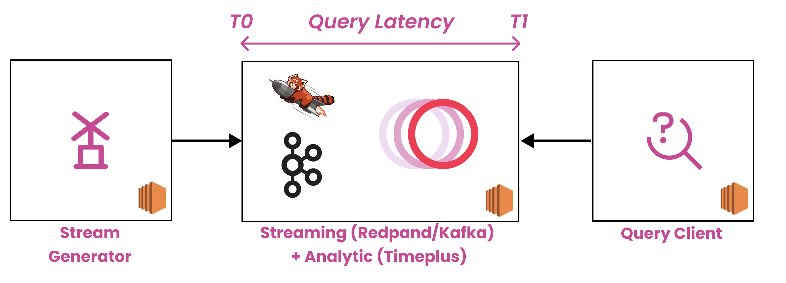

# Introduction

This (dataload) tool aims to ingest [IoT CSV or JSON metric](https://github.com/timeplus-io/timeplus-redpanda-benchmark/blob/master/models/metric.go) data to external streaming stores : Redpanda and Kafka and then we streaming query the data directly from Kafka / Redpanda in realtime by using Timeplus. The intial goals are finding how Timeplus works in this scenario.


# Build This Tool

After `go get` or `git clone` this repo, go to `cmd` directory and run

```
go build dataloader.go
```

The above command will produce a binary `dataloader`. We will use it to load data later.

# Workflow

dataload ingest data -> Kafka / Redpanda <- Streaming Query in Timeplus


# Ingest Details

In [config.yml](https://github.com/timeplus-io/timeplus-redpanda-benchmark/blob/master/config/config.yml), we can tune the batch size, concurrency, Kafka/Redpanda producer latency etc when loading the data to Kafka / Redpanda. We will use different batch size, concurrency, flush policy to ingest data to see how everything works.
In order to test the end to end latency, this dataloader ingests a speicial header called `_tp_time` as the event timestamp to every Kafka/Redpanda record.  This special header in Kafka / Redpanda record is one of the speicial metadata Timeplus can honor.

# Test Steps

Step 1, launch the dataloader to ingest data (please remember to tune `config.yml` for different scenarios, and point it to your Kafka/Redpanda brokers). The dataloader will
create the corresponding topic automatically.


```
./cmd/dataloader --config config/config.yml
```

Step 2, create an `EXTERNAL STREAM` in Timeplus to point the topic

```sql
CREATE EXTERNAL STREAM device_utils_external_stream(src string)
SETTINGS type='redpanda', brokers='localhost:9092', topic='device_utils'
```


Step 3, use Timeplus streaming query to check the end 2 end latency.

```sql
SELECT p90(_tp_process_time - _tp_time)
FROM device_utils_external_stream
SETTINGS record_consume_timeout=10;
```

In the above query, `_tp_process_time` is when Timeplus reads the ingested events from Kafka / Redpanda. `_tp_time` is the timestamp ingested by the data loader and re-parsed by Timeplus.

The setting parameter `record_consume_timeout` is a low level latency tuning setting in Timeplus which basically controls the timeout in milliseconds value when consuming from Kafka / Redpanda. The high value `record_consume_timeout` is, the lower latency, but may impact throughput and vice versa.


We can use the following query to check the consume throughput (eps) as well by using Timeplus SQL

```sql
SELECT
    count() AS current_total,
    lag(current_total, 1, 0) AS prev_total,
    (current_total - prev_total) * 100 AS eps
FROM device_utils_external_stream
EMIT PERIODIC 1s;
```

The above query keeps counting number of Kafka / Redpanda messages has been consumed and it maintains current grant total and last grant total, the difference of these 2 is basically the throughput (eps) since the query emits the result every second. Since each Kafka / Redpanda message contains a batch
of events, hence there is a mulitply there.

# Build & Run 

run `go build cmd/dataloader.go` or `make build` , and the run `dataloader --config=<your_config_file>` to load data to configured kafka or redpanda broker 

# Quick Start with Docker

1. run `make docker` to build a docker image locally
2. go to `docker/kafka` or `docker/redpanda` and then run `make run` or `docker-compose up -d`to start the test data loading
3. run `make consume` to insepct generated data stream
4. run `make stop` or `docker-compose down` to stop data geneating

# Note

Please note as the data loader will generating large volume of data and might use a lot of disk space, please make sure stop it or prune the disk space when required.

